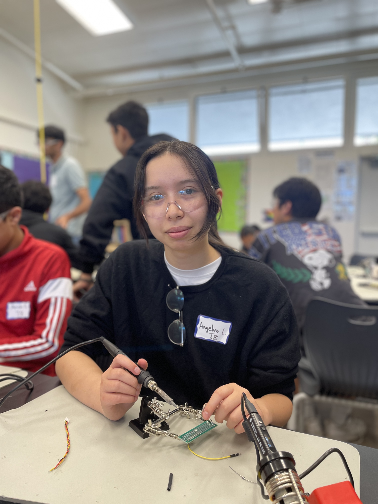

# Biometric Health Monitor
Monitor your pulse rate with a device that uses a pulse sensor and displays the BPM.
```
You should comment out all portions of your portfolio that you have not completed yet, as well as any instructions:
```HTML 
<!--- This is an HTML comment in Markdown -->
<!--- Anything between these symbols will not render on the published site -->
```

| **Engineer** | **School** | **Area of Interest** | **Grade** |
|:--:|:--:|:--:|:--:|
| Angelina L | Fusion Academy | Engineering | Incoming Senior
```
**Replace the BlueStamp logo below with an image of yourself and your completed project. Follow the guide [here](https://tomcam.github.io/least-github-pages/adding-images-github-pages-site.html) if you need help.**
```

  
# Final Milestone

**Don't forget to replace the text below with the embedding for your milestone video. Go to Youtube, click Share -> Embed, and copy and paste the code to replace what's below.**

<iframe width="560" height="315" src="https://www.youtube.com/embed/F7M7imOVGug" title="YouTube video player" frameborder="0" allow="accelerometer; autoplay; clipboard-write; encrypted-media; gyroscope; picture-in-picture; web-share" allowfullscreen></iframe>

For your final milestone, explain the outcome of your project. Key details to include are:
- What you've accomplished since your previous milestone
- What your biggest challenges and triumphs were at BSE
- A summary of key topics you learned about
- What you hope to learn in the future after everything you've learned at BSE


# Second Milestone

**Don't forget to replace the text below with the embedding for your milestone video. Go to Youtube, click Share -> Embed, and copy and paste the code to replace what's below.**

<iframe width="560" height="315" src="https://www.youtube.com/embed/Moxyzs_mXPI?si=uLDX-i6YB_VoxUuf" title="YouTube video player" frameborder="0" allow="accelerometer; autoplay; clipboard-write; encrypted-media; gyroscope; picture-in-picture; web-share" referrerpolicy="strict-origin-when-cross-origin" allowfullscreen></iframe>

For your second milestone, explain what you've worked on since your previous milestone. You can highlight:
- Technical details of what you've accomplished and how they contribute to the final goal
- What has been surprising about the project so far
- Previous challenges you faced that you overcame
- What needs to be completed before your final milestone 

# First Milestone

**Don't forget to replace the text below with the embedding for your milestone video. Go to Youtube, click Share -> Embed, and copy and paste the code to replace what's below.**

<iframe width="560" height="315" src="https://www.youtube.com/embed/pMdxTMcL-Zo?si=n6XMW6lGNCbqFJfc" title="YouTube video player" frameborder="0" allow="accelerometer; autoplay; clipboard-write; encrypted-media; gyroscope; picture-in-picture; web-share" referrerpolicy="strict-origin-when-cross-origin" allowfullscreen></iframe>

For your first milestone, describe what your project is and how you plan to build it. You can include:
- An explanation about the different components of your project and how they will all integrate together
- Technical progress you've made so far
- Challenges you're facing and solving in your future milestones
- What your plan is to complete your project

# Schematics 
Here's where you'll put images of your schematics. [Tinkercad](https://www.tinkercad.com/blog/official-guide-to-tinkercad-circuits) and [Fritzing](https://fritzing.org/learning/) are both great resoruces to create professional schematic diagrams, though BSE recommends Tinkercad becuase it can be done easily and for free in the browser. 

# Code
Here's where you'll put your code. The syntax below places it into a block of code. Follow the guide [here]([url](https://www.markdownguide.org/extended-syntax/)) to learn how to customize it to your project needs. 

```c++
// Include necessary libraries
#define USE_ARDUINO_INTERRUPTS true
#include <PulseSensorPlayground.h>
#include <LiquidCrystal_I2C.h>
LiquidCrystal_I2C lcd(0x27, 16, 2); // set the LCD address to 0x27 for a 16 chars and 2 line display
 
 
// Constants
const int PULSE_SENSOR_PIN = 0;  // Analog PIN where the PulseSensor is connected
const int LED_PIN = 13;          // On-board LED PIN
const int THRESHOLD = 550;       // Threshold for detecting a heartbeat
 
// Create PulseSensorPlayground object
PulseSensorPlayground pulseSensor;
 
void setup()
{
  // Initialize Serial Monitor
  Serial.begin(9600);
  lcd.init();
  lcd.backlight();
 
  // Configure PulseSensor
  pulseSensor.analogInput(PULSE_SENSOR_PIN);
  pulseSensor.blinkOnPulse(LED_PIN);
  pulseSensor.setThreshold(THRESHOLD);
 
  // Check if PulseSensor is initialized
  if (pulseSensor.begin())
  {
    Serial.println("PulseSensor object created successfully!");
  }
}
 
void loop()
{
  lcd.setCursor(0, 0);
  lcd.print("Heart Rate");
  
  // Get the current Beats Per Minute (BPM)
  int currentBPM = pulseSensor.getBeatsPerMinute();
 
  // Check if a heartbeat is detected
  if (pulseSensor.sawStartOfBeat())
  {
    Serial.println("♥ A HeartBeat Happened!");
    Serial.print("BPM: ");
    Serial.println(currentBPM);
 
    lcd.clear();
    lcd.setCursor(0, 1);
    lcd.print("BPM: ");
    lcd.print(currentBPM);
  }
 
  // Add a small delay to reduce CPU usage
  delay(20);
}
```

# Bill of Materials
Here's where you'll list the parts in your project. To add more rows, just copy and paste the example rows below.
Don't forget to place the link of where to buy each component inside the quotation marks in the corresponding row after href =. Follow the guide [here]([url](https://www.markdownguide.org/extended-syntax/)) to learn how to customize this to your project needs. 

| **Part** | **Note** | **Price** | **Link** |
|:--:|:--:|:--:|:--:|
| Item Name | What the item is used for | $Price | <a href="https://www.amazon.com/Arduino-A000066-ARDUINO-UNO-R3/dp/B008GRTSV6/"> Link </a> |
| Item Name | What the item is used for | $Price | <a href="https://www.amazon.com/Arduino-A000066-ARDUINO-UNO-R3/dp/B008GRTSV6/"> Link </a> |
| Item Name | What the item is used for | $Price | <a href="https://www.amazon.com/Arduino-A000066-ARDUINO-UNO-R3/dp/B008GRTSV6/"> Link </a> |

# Other Resources/Examples
One of the best parts about Github is that you can view how other people set up their own work. Here are some past BSE portfolios that are awesome examples. You can view how they set up their portfolio, and you can view their index.md files to understand how they implemented different portfolio components.
- [Example 1](https://trashytuber.github.io/YimingJiaBlueStamp/)
- [Example 2](https://sviatil0.github.io/Sviatoslav_BSE/)
- [Example 3](https://arneshkumar.github.io/arneshbluestamp/)

To watch the BSE tutorial on how to create a portfolio, click here.

# RGB LED Slider
Create colorful light displays with these RGB sliders, which allow you to adjust the intensity of red, green, and blue lights individually.



<iframe width="560" height="315" src="https://www.youtube.com/embed/pBlX93JHfoM?si=glxoXZyOp1qT-VlQ" title="YouTube video player" frameborder="0" allow="accelerometer; autoplay; clipboard-write; encrypted-media; gyroscope; picture-in-picture; web-share" referrerpolicy="strict-origin-when-cross-origin" allowfullscreen></iframe>

# Bill of Materials

| **Part** | **Note** | **Price** | **Link** |
|:--:|:--:|:--:|:--:|
| DIY Soldering Practice Kit RGB Practice Learning Electronics Training Board | Learn soldering and color mixing | $7.99 | <a href="https://www.amazon.com/gp/product/B0BKM3D927/ref=ppx_yo_dt_b_search_asin_title?ie=UTF8&psc=1"> Link </a> |
